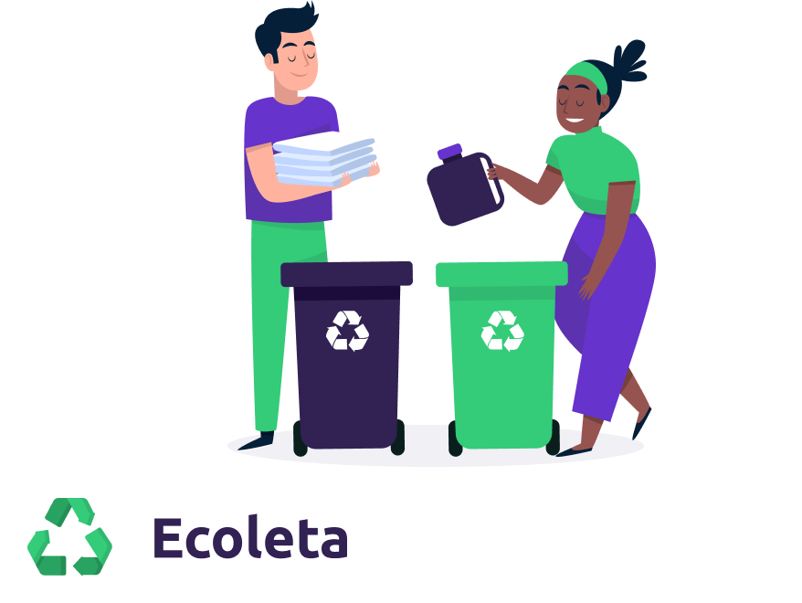

<h1 align="center">
    
</h1>

<h4 align="center"> 
	♻️ Ecoleta ♻️
</h4>

  

  
	
  

  

  
<a aria-label="Completed" href="https://rocketseat.com.br/week-10/aulas#4">
    </img>
  </a>
  

  <a href="#-project">Project</a>
  &nbsp;&nbsp;&nbsp;|&nbsp;&nbsp;&nbsp;
  <a href="#rocket-Technologies">Technologies</a>
  &nbsp;&nbsp;&nbsp;|&nbsp;&nbsp;&nbsp;
  <a href="#-layout">Layout</a>
  &nbsp;&nbsp;&nbsp;|&nbsp;&nbsp;&nbsp;
  <a href="#-apidoc">Api Doc</a>
  &nbsp;&nbsp;&nbsp;|&nbsp;&nbsp;&nbsp;
  <a href="#-how-to-contribute">How to contribute</a>
  &nbsp;&nbsp;&nbsp;|&nbsp;&nbsp;&nbsp;
  <a href="#memo-license">License</a>

## 💻 Project

Ecoleta is a project that aims to facilitate the finding of waste collection sites efficiently.

<h1 align="center">
    
</h1>

## :rocket: Technologies

This project was developed with the following technologies:

- [Node.js](https://nodejs.org/en/) 
  - [jsonwebtoken](https://github.com/auth0/node-jsonwebtoken#readme)
  - [postgres](https://www.postgresql.org/)
  - [express](https://expressjs.com/)
  - [multer](https://github.com/expressjs/multer)
  - [dotenv](https://github.com/motdotla/dotenv)
  - [knex](http://knexjs.org/)
- [React](https://reactjs.org)
    - [styled-components](https://styled-components.com/)
    - [react-router-dom](https://www.npmjs.com/package/react-router-dom)
    - [react-dropzone](https://github.com/react-dropzone/react-dropzone)
    - [react-leaflet](https://react-leaflet.js.org/)
    - [react-icons](https://github.com/react-icons/react-icons)
    - [typescript](https://www.typescriptlang.org/)
    - [axios](https://github.com/axios/axios)
- [React Native](https://facebook.github.io/react-native/)
  - [Expo](https://expo.io/)
    [react-native-shimmer-placeholder](https://github.com/tomzaku/react-native-shimmer-placeholder)
    [@react-navigation/native](https://reactnavigation.org/)
    [@expo-google-fonts](https://docs.expo.io/guides/using-custom-fonts/)
    [expo-splash-screen](https://docs.expo.io/versions/latest/sdk/splash-screen/)
    [react-native-maps](https://github.com/react-native-community/react-native-maps)
    [styled-components](https://styled-components.com/)
    [react-native-svg](https://github.com/react-native-community/react-native-svg)
    [expo-facebook](https://docs.expo.io/versions/latest/sdk/facebook/)
    [expo-location](https://docs.expo.io/versions/latest/sdk/location/)
    [expo-camera](https://docs.expo.io/versions/latest/sdk/camera/)
    [axios](https://github.com/axios/axios)

## :art: Layout

To access the layout use the tool [Figma](https://www.figma.com/file/2C2yvw7jsCOGmaNUDftX9n/Be-The-Hero---OmniStack-11?node-id=0%3A1).

## :notebook: Api Doc

You can access the api documentation [here](https://godrix.github.io/ecoleta/).

## 🤝 Contributing

Contributions, issues and feature requests are welcome! Feel free to check [issues page](https://github.com/godrix/ecoleta/issues).
- Make a fork;
- Create a branck with your feature: `git checkout -b my-feature`;
- Commit changes: `git commit -m 'feat: My new feature'`;
- Make a push to your branch: `git push origin my-feature`.

After merging your receipt request to done, you can delete a branch from yours.

## Show your support

Give a ⭐️ if this project helped you!

## :memo: License

This project is under the MIT license. See the [LICENSE](LICENSE.md) for details.

---

Made with ♥ by Godrix :wave: [Get in touch!](https://www.linkedin.com/in/carlosgodri/)